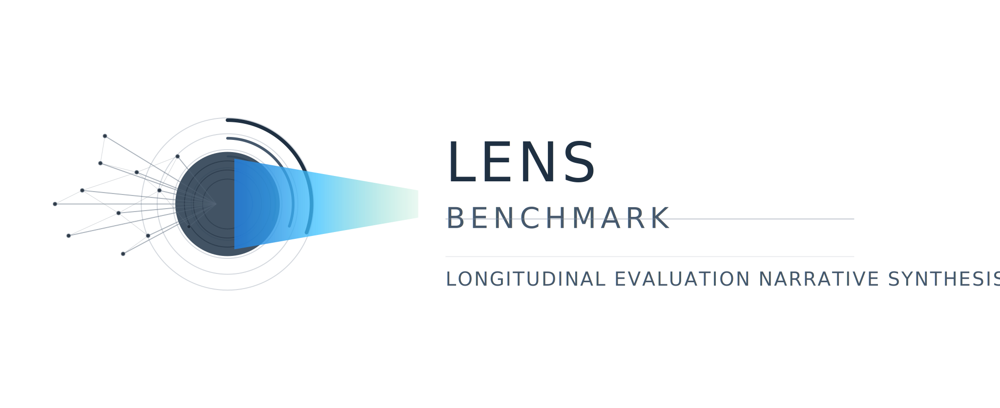

<p align="center">
  
</p>


---

## > WHAT IS LENS //

Most retrieval benchmarks dump a static corpus and test search quality. Real memory systems receive information **incrementally** — a support ticket each day, a sensor reading each hour, a clinical note each week — and must surface patterns that only emerge after enough data accumulates.

LENS streams timestamped episodes into your memory system chronologically, pauses at checkpoints to ask questions requiring synthesis across many episodes, and scores whether your system enables longitudinal reasoning — not just keyword retrieval.

If a single episode can answer the question, the benchmark is broken. LENS ensures signal only emerges from the *progression*.

---

## > LEADERBOARD //

Full results and methodology: [LEADERBOARD.md](LEADERBOARD.md)

### V1: Adapter Benchmark

Modal driver, Qwen3.5-35B-A3B agent, 6 scopes (S07-S12):

| Rank | Adapter | Mean AQ | Category |
|-----:|---------|--------:|----------|
| 1 | graphrag-light | 0.462 | Graph |
| 2 | sqlite-chunked-hybrid | 0.431 | Hybrid |
| 3 | letta | 0.413 | Agent Memory |
| 4 | hopping-hybrid | 0.408 | Hybrid |
| 5 | hopping | 0.404 | Hop-based |
| 6 | letta-sleepy | 0.404 | Agent Memory |
| 7 | hierarchical-hybrid | 0.388 | Hybrid |
| 8 | triadv1-pairs | 0.377 | Triad |
| 9 | hierarchical | 0.369 | Hierarchical |
| 10 | letta-v4 | 0.338 | Agent Memory |
| 11 | null | 0.328 | Baseline |

### V2: Memory Strategy Ablation

7 scopes, M=3 repetitions, Fact F1:

| Rank | Policy | Fact F1 | n |
|-----:|--------|--------:|----:|
| 1 | policy_core_faceted | 0.511 | 200 |
| 2 | policy_core | 0.486 | 201 |
| 3 | policy_core_structured | 0.472 | 202 |
| 4 | policy_summary | 0.457 | 200 |
| 5 | policy_core_maintained | 0.427 | 198 |
| 6 | policy_base | 0.412 | 202 |
| 7 | null | 0.059 | 204 |

---

## > HOW IT WORKS //

```
                    ┌─────────────┐
                    │  spec.yaml  │    Dataset definition
                    └──────┬──────┘
                           │
                    ┌──────▼──────┐
                    │   Episodes  │    30 signal + 90 distractor
                    └──────┬──────┘
                           │ stream chronologically
                    ┌──────▼──────┐
                    │   Adapter   │    Your memory system
                    │  .ingest()  │    implements MemoryAdapter
                    └──────┬──────┘
                           │ at checkpoints...
                    ┌──────▼──────┐
                    │    Agent    │    Budget-constrained LLM
                    │  .search()  │    interrogates memory via
                    │  .retrieve()│    adapter's tool interface
                    └──────┬──────┘
                           │
                    ┌──────▼──────┐
                    │   Scorer    │    3-tier scoring
                    │  tier1: mech│    mechanical → LLM judge
                    │  tier2: llm │    → differential
                    │  tier3: diff│
                    └─────────────┘
```

1. **Adapter wraps your memory system** — Implement `MemoryAdapter` with `search`, `retrieve`, and `get_capabilities`. The runner calls `ingest` to feed episodes.
2. **Episodes stream chronologically** — 30 signal episodes follow a 5-phase narrative arc (baseline → early signal → red herring → escalation → root cause), interleaved with 90 format-matched distractors.
3. **At checkpoints, an LLM agent interrogates memory** — A budget-constrained agent answers questions using only `memory_search`, `memory_retrieve`, and `memory_capabilities`. No direct access to raw episodes.
4. **Three-tier scoring** — Mechanical metrics (fact recall, evidence grounding), LLM judge (pairwise answer quality), and differential metrics (longitudinal advantage over baseline).

---

## > QUICK START //

```bash
# Clone and install
git clone https://github.com/synix-dev/lens-benchmark.git
cd lens-benchmark
uv sync --all-extras

# Smoke test (null adapter, mock LLM)
uv run lens smoke

# Run tests
uv run pytest tests/unit/ -v
```

See [QUICKSTART.md](docs/guides/QUICKSTART.md) for a full walkthrough: running against a real adapter, scoring results, and generating reports.

---

## > WRITE YOUR OWN ADAPTER //

Subclass `MemoryAdapter` and implement five methods:

```python
from lens.adapters.base import MemoryAdapter, CapabilityManifest, SearchResult, Document
from lens.adapters.registry import register_adapter

@register_adapter("my-memory")
class MyAdapter(MemoryAdapter):
    def reset(self, scope_id: str) -> None:
        self.store = {}

    def ingest(self, episode_id: str, scope_id: str,
               timestamp: str, text: str, meta: dict | None = None) -> None:
        self.store[episode_id] = text

    def search(self, query: str, filters: dict | None = None,
               limit: int | None = None) -> list[SearchResult]:
        results = []
        for eid, text in self.store.items():
            if query.lower() in text.lower():
                results.append(SearchResult(ref_id=eid, text=text[:200], score=1.0))
        return results[:limit or 10]

    def retrieve(self, ref_id: str) -> Document | None:
        text = self.store.get(ref_id)
        return Document(ref_id=ref_id, text=text) if text else None

    def get_capabilities(self) -> CapabilityManifest:
        return CapabilityManifest(search_modes=["keyword"], max_results_per_search=10)
```

Full guide: [ADAPTER_GUIDE.md](docs/guides/ADAPTER_GUIDE.md)

---

## > SUBMIT A RUN //

1. Run the full benchmark (S07-S12) with your adapter
2. Score results with the LENS scorer
3. Open a PR with your scores and run artifacts

Full guide: [SUBMISSION_GUIDE.md](docs/guides/SUBMISSION_GUIDE.md)

---

## > CONTRIBUTE A SCOPE //

Scopes define benchmark scenarios. Each scope has:
- A domain (system logs, clinical notes, financial reports, ...)
- A 5-phase narrative arc with signal distributed across 30 episodes
- Key facts that require multi-episode synthesis
- Questions at checkpoints testing longitudinal reasoning

Current scopes span: cascading failures, financial irregularity, clinical signals, environmental drift, insider threats, market regimes, jailbreak detection, corporate acquisition, shadow APIs, clinical trials, zoning corruption, therapy chat, implicit decisions, epoch classification, value inversion, and parking friction.

Full guide: [SCOPE_GUIDE.md](docs/guides/SCOPE_GUIDE.md)

---

## > PROJECT STRUCTURE //

```
src/lens/
  adapters/          MemoryAdapter ABC, null/sqlite builtins, registry
  agent/             Agent harness, tool bridge, budget enforcement
  cli/               Click CLI (run, score, report, smoke, ...)
  core/              Episode, Question, GroundTruth, ScoreCard
  datagen/synix/     Two-stage dataset generation pipeline
  datasets/          Dataset loading
  matcher/           Answer matching
  report/            Report generation
  runner/            Benchmark runner with EpisodeVault anticheat
  scorer/            3-tier scoring (mechanical, judge, differential)
datasets/scopes/     16 scope specifications + generated artifacts
tests/unit/          1040 unit tests
docs/                Documentation and guides
```

---

## > DOCUMENTATION //

| Document | Description |
|----------|-------------|
| [Quick Start](docs/guides/QUICKSTART.md) | Install, run, score — end to end |
| [Adapter Guide](docs/guides/ADAPTER_GUIDE.md) | Write and register a memory adapter |
| [Scope Guide](docs/guides/SCOPE_GUIDE.md) | Design and build a benchmark scope |
| [Submission Guide](docs/guides/SUBMISSION_GUIDE.md) | Submit a validated run for the leaderboard |
| [Leaderboard](LEADERBOARD.md) | Current results and methodology |
| [Contributing](CONTRIBUTING.md) | How to contribute |
| [Architecture](docs/architecture.md) | Core data flow, adapter system, scoring internals |
| [Methodology](docs/methodology.md) | Dataset generation, contamination prevention |
| [Calibration](docs/calibration.md) | Naive baseline calibration and key fact design |

---

## > SCORING //

### V2 Scoring (Current)

V2 uses **Fact F1**: each ground-truth key fact is graded as present or absent in the agent's answer by a few-shot Qwen3.5-35B-A3B judge. Precision, recall, and F1 are computed across all key facts per question, then averaged across questions and scopes. This is more granular than holistic answer quality — it measures whether specific atomic claims were recovered from memory.

### V1 Scoring (Legacy)

V1 uses nine metrics across three tiers:

**Tier 1 — Mechanical** (no LLM judge):
- `evidence_grounding` (10%) — cited ref_ids that exist in the vault
- `fact_recall` (10%) — ground-truth key facts found in answer
- `evidence_coverage` (10%) — required evidence episodes retrieved
- `budget_compliance` (10%) — budget violations penalty

**Tier 2 — LLM Judge**:
- `answer_quality` (15%) — pairwise vs. canonical ground truth
- `insight_depth` (15%) — refs from 2+ distinct episodes
- `reasoning_quality` (10%) — substantive answers with tool use

**Tier 3 — Differential**:
- `longitudinal_advantage` (15%) — synthesis questions minus control questions
- `action_quality` (5%) — action recommendation quality

Hard gate: `evidence_grounding` or `budget_compliance` below 0.5 zeros the composite.

---

## > CITATION //

```bibtex
@software{lens_benchmark,
  title  = {LENS: Longitudinal Evidence-backed Narrative Signals},
  author = {LENS Contributors},
  year   = {2025},
  url    = {https://github.com/synix-dev/lens-benchmark}
}
```

---

## > LICENSE //

[MIT](LICENSE)
