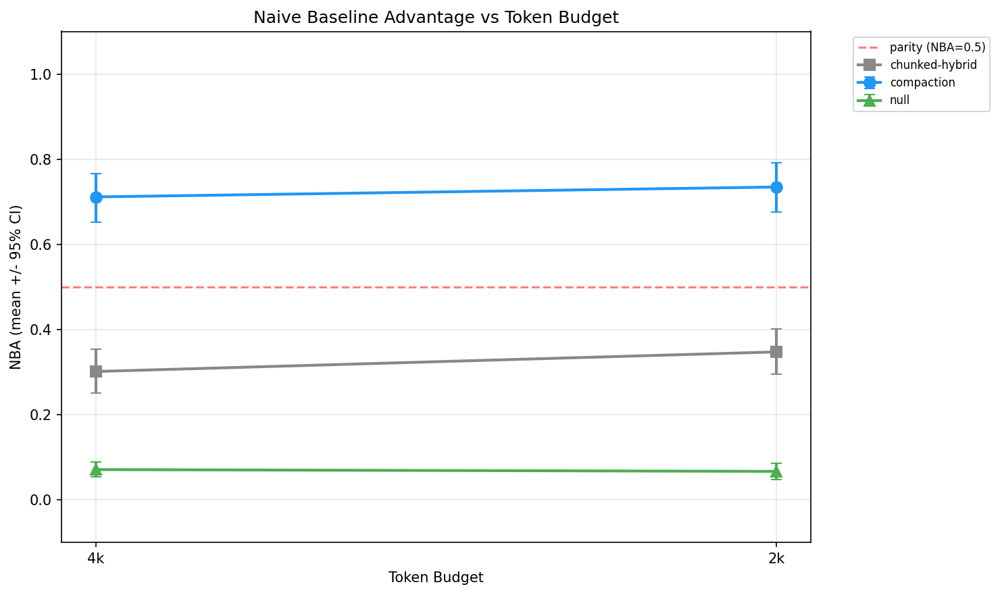

# Constrained Budget Validation — Results Summary

**Date**: 2026-02-22
**Runs**: 36 scored, 2 failed (cognee)
**Agent LLM**: Qwen3-235B-A22B (Together AI serverless)
**Judge LLM**: Qwen3-235B-A22B (Together AI serverless)
**Budgets**: 4,096 tokens (constrained-4k), 2,048 tokens (constrained-2k)
**Scopes**: All 6 (cascading failure, financial, clinical, environmental, insider threat, market regime)

---

## Core Finding

**Hypothesis validated.** At constrained token budgets (4K/2K), where agents can only see 13-25% of episodes, retrieval quality strongly separates memory systems from context stuffing.

At standard budget (32K tokens), every adapter showed NBA < 0.5 — the naive baseline could stuff all episodes into context and win. At constrained budgets, the separation is massive: compaction beats context stuffing 73% of the time, chunked-hybrid beats it 35%, and the null adapter barely wins 7%.

---

## Aggregate Results (pooled across 6 scopes, N=120 per-question observations each)

| Adapter | 4K NBA (mean) | 4K 95% CI | 2K NBA (mean) | 2K 95% CI |
|---------|--------------|-----------|---------------|-----------|
| **compaction** | **0.711** | [0.652, 0.767] | **0.735** | [0.676, 0.791] |
| chunked-hybrid | 0.301 | [0.250, 0.354] | 0.347 | [0.295, 0.401] |
| null | 0.071 | [0.053, 0.089] | 0.067 | [0.048, 0.086] |



---

## Statistical Tests

### Adapter vs Null (Wilcoxon signed-rank, paired by question)

| Comparison | p-value | Significance |
|------------|---------|--------------|
| compaction vs null @ 4K | < 0.0001 | *** |
| compaction vs null @ 2K | < 0.0001 | *** |
| chunked-hybrid vs null @ 4K | < 0.0001 | *** |
| chunked-hybrid vs null @ 2K | < 0.0001 | *** |

### Budget Degradation (4K to 2K)

| Adapter | Mean delta | p-value | Significant? |
|---------|-----------|---------|--------------|
| compaction | -0.023 | 0.284 | No |
| chunked-hybrid | -0.046 | 0.072 | No |
| null | +0.004 | 0.762 | No |

Neither adapter degrades significantly when the budget is halved from 4K to 2K. The retrieval advantage holds.

### Differential Degradation (does the adapter hold up better than null?)

| Adapter | Interaction | 95% CI | Interpretation |
|---------|-------------|--------|----------------|
| chunked-hybrid | -0.050 | [-0.103, +0.004] | No significant difference |
| compaction | -0.028 | [-0.087, +0.034] | No significant difference |

Both adapters and null degrade at similar rates (or rather, don't degrade). The advantage is already established at 4K and holds steady at 2K.

---

## Per-Scope Breakdown (NBA)

| Adapter | S01 | S02 | S03 | S04 | S05 | S06 | Mean |
|---------|-----|-----|-----|-----|-----|-----|------|
| compaction/4k | 0.787 | 0.621 | 0.740 | 0.675 | 0.563 | 0.672 | 0.676 |
| compaction/2k | 0.790 | 0.722 | 0.642 | 0.659 | 0.710 | 0.650 | 0.695 |
| chunked-hybrid/4k | 0.479 | 0.274 | 0.263 | 0.345 | 0.294 | 0.352 | 0.334 |
| chunked-hybrid/2k | 0.466 | 0.444 | 0.240 | 0.371 | 0.328 | 0.388 | 0.373 |
| null/4k | 0.168 | 0.161 | 0.166 | 0.096 | 0.128 | 0.136 | 0.142 |
| null/2k | 0.150 | 0.151 | 0.150 | 0.117 | 0.115 | 0.150 | 0.139 |

Compaction is the strongest adapter on every scope. Chunked-hybrid is second on every scope. The ranking is completely stable across all 6 domains.

---

## Interpretation

### Why compaction dominates

Compaction (summarize-then-answer) re-summarizes all buffered episodes from scratch at each checkpoint. Under constrained budgets, this summary is the single search result the agent sees. It captures the full arc compressed into a few thousand tokens — signal density is maximal.

Chunked-hybrid (FTS + embedding search) retrieves relevant chunks, but relevance is assessed per-chunk, not per-arc. At 2K tokens it can fit maybe 4-5 episode chunks. The chunks may cover the right episodes but miss the progression that connects them.

The null adapter returns nothing — the agent answers from its own context window, which under constrained budgets contains only the most recent episodes. It essentially guesses.

### What this means for the benchmark

At standard budget (32K), context stuffing wins because the naive baseline can include everything. This makes NBA useless for discriminating memory systems at standard budget. Constrained budgets (4K/2K) create a regime where retrieval quality genuinely matters, and NBA becomes a meaningful metric.

This validates the design of the constrained budget presets and suggests that future benchmark runs should include constrained budgets alongside standard to get a complete picture of adapter quality.

### The open question

Compaction is a brute-force strategy — it throws away nothing but compresses everything. More sophisticated systems (Letta-sleepy's delta/causal consolidation, cognee's GraphRAG, graphiti's temporal knowledge graph) should in theory be more selective and efficient. The Phase 2 runs (6 additional adapters) will test whether any sophisticated retrieval strategy can match or beat compaction's summarize-everything approach under constrained budgets.

---

## What's Complete

- **36 scored runs**: 3 adapters (null, chunked-hybrid, compaction) x 6 scopes x 2 budgets
- **Statistical analysis**: Bootstrap CIs (10K resamples), paired Wilcoxon tests, budget degradation tests, differential degradation
- **Artifacts**: `results/constrained_validation.json`, `results/constrained_analysis.json`, `results/constrained_degradation_aggregate.png`
- **Infrastructure**: Phased orchestrator with state tracking, resume, concurrent execution

## What's Remaining (Phase 2)

6 adapters need external services to run:

| Adapter | Service Required | Priority |
|---------|-----------------|----------|
| letta-sleepy | Letta server :8283 | High — delta/causal consolidation might rival compaction |
| cognee | DB reset needed | High — GraphRAG had best evidence_coverage at standard budget |
| letta | Letta server :8283 | Medium — base Letta for comparison |
| graphiti | FalkorDB :6379 | Medium — temporal KG, different retrieval paradigm |
| mem0-raw | Qdrant :6333 | Lower — simple vector search |
| hindsight | Hindsight :8888 | Lower — had budget compliance issues at standard budget |

To run Phase 2: start the required services, then:
```bash
python3 scripts/run_constrained_validation.py --phase 2
python3 scripts/run_constrained_validation.py --phase 3 --adapters letta-sleepy cognee letta graphiti mem0-raw hindsight
python3 scripts/analyze_constrained.py --aggregate
```
