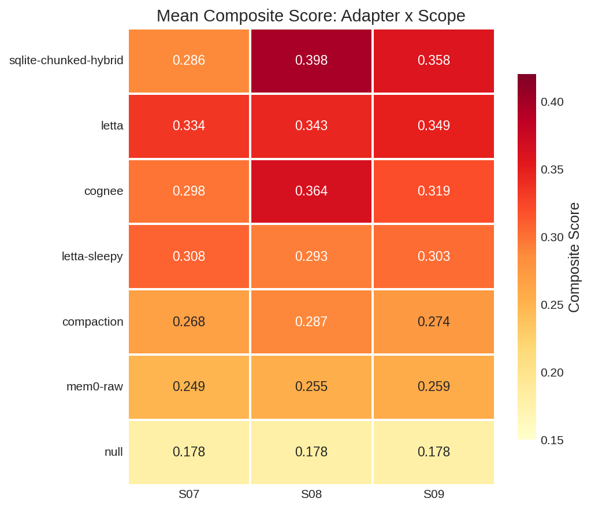
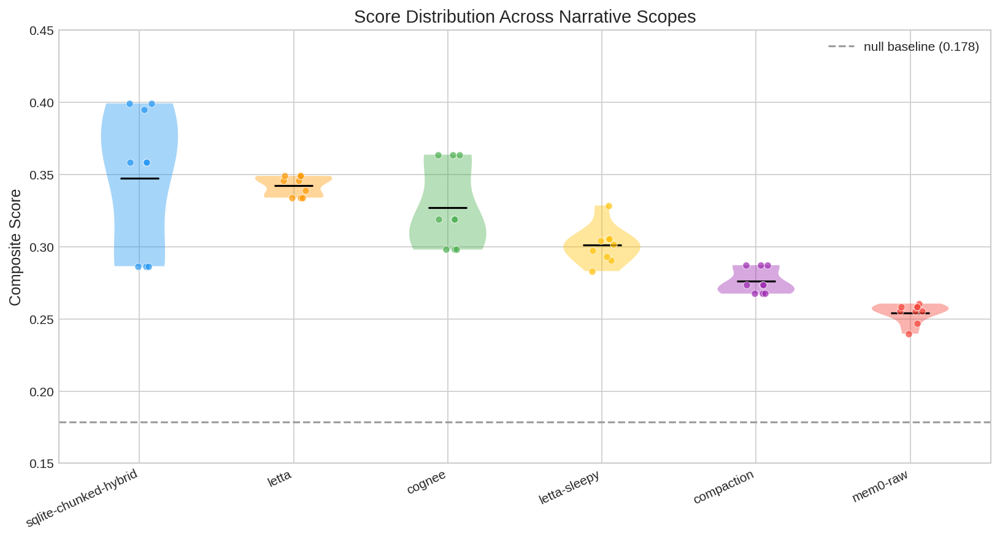

# LENS Narrative Scope Benchmark Brief

**Date:** 2026-02-27
**Runs:** 63 (7 adapters × 3 scopes × 3 reps)
**Infrastructure:** Llama 3.3 70B AWQ on A100 (Modal), gte-modernbert-base embeddings on T4

---

## 1. Executive Summary

We evaluated 7 memory system architectures on 3 narrative benchmark scopes — realistic document bundles (chat logs, corporate emails, HTTP traces) averaging 5,000 words per episode. Each scope contains 40 episodes (20 signal + 20 distractor) and 10 questions answerable only by synthesizing evidence across multiple episodes.

**Key finding:** All memory systems scored between 0.18–0.35 on narrative scopes (vs. 0.25–0.45 on numeric scopes). The performance ceiling dropped because narrative signal is encoded as *behavioral patterns across episodes* rather than as explicit metric progressions. Every adapter's retrieval queries paraphrase the question text, but the evidence uses different vocabulary entirely — a fundamental query-evidence mismatch that no current architecture addresses.

### Rankings

| Rank | Adapter | Architecture | Composite | Total Time |
|------|---------|-------------|-----------|------------|
| 1 | sqlite-chunked-hybrid | Chunk + Embed + FTS5 | **0.348** | 700s |
| 2 | letta | Agent memory (archival) | **0.342** | 579s |
| 3 | cognee | Knowledge graph | **0.327** | 531s |
| 4 | letta-sleepy | Agent memory + consolidation | **0.301** | 866s |
| 5 | compaction | LLM summarization | **0.276** | 304s |
| 6 | mem0-raw | Raw vector search | **0.254** | 558s |
| 7 | null (no memory) | Baseline | **0.179** | 90s |

---

## 2. Methodology

### Benchmark Design

LENS (Longitudinal Evidence-backed Narrative Signals) tests whether an LLM agent with a memory system can synthesize conclusions from evidence **distributed across many sequential episodes**. Unlike single-document QA, no individual episode answers any question — the signal only emerges from reading across the full sequence.

**Two-stage isolation prevents contamination:**
1. A planning LLM (sees the full storyline) encodes signal as structured data — metric values, metadata fields, behavioral patterns
2. A rendering LLM (blind to the storyline) formats each data sheet into a realistic document independently

This ensures signal only emerges from the *progression* across episodes, never from editorializing within a single episode.

### Narrative Scopes

| Scope | Scenario | Document Format | Signal Type |
|-------|----------|----------------|-------------|
| S07 | AI Tutoring Jailbreak | Student/tutor chat transcripts | Behavioral escalation pattern |
| S08 | Corporate Acquisition | Board minutes, Slack, emails, legal memos | Hidden strategic intent across document types |
| S09 | Shadow API Abuse | HTTP logs, deploy manifests, Grafana alerts | Infrastructure anomaly pattern |

Each scope: 20 signal episodes + 20 format-matched distractors, ~5,000 words per episode (~280K tokens total per scope).

### Evaluation Protocol

At 4 checkpoints (episodes 6, 12, 16, 20), the agent receives questions and must answer using only its memory system's search/retrieve tools. Each question is scored on:

- **Tier 1 (mechanical):** evidence_grounding, fact_recall, evidence_coverage, citation_coverage
- **Tier 2 (LLM judge):** answer_quality, insight_depth, reasoning_quality
- **Tier 3 (differential):** naive_baseline_advantage, action_quality

3 repetitions per configuration confirm reproducibility. All runs use temperature=0.

### Adapters Under Test

| Adapter | Write Strategy | Read Strategy | LLM at Ingest? |
|---------|---------------|---------------|-----------------|
| **sqlite-chunked-hybrid** | Chunk episodes → embed + FTS5 index | RRF-fused hybrid (semantic + keyword) search | Embed only |
| **letta** | Store in archival memory via Letta API | Letta's built-in semantic search | Embed only |
| **cognee** | Raw storage → knowledge graph in prepare() | Graph-augmented retrieval | At prepare() |
| **letta-sleepy** | Store + periodic sleep/wake consolidation | Semantic search + sleep memories | At consolidation |
| **compaction** | Buffer → LLM summarization in prepare() | Return summary as single result | At prepare() |
| **mem0-raw** | Direct vector storage (infer=False) | Qdrant semantic search | Embed only |
| **null** | No-op | Returns nothing | No |

### Systems That Failed to Scale

Two additional adapters were tested but could not complete narrative scope runs:

- **Graphiti** (knowledge graph): Context window overflow at checkpoint 16. The accumulated entity/relationship data (~106K tokens) plus generation budget exceeded the 113K context window. Fundamental architectural limitation — the graph grows superlinearly with episode count.
- **Hindsight** (fact extraction + consolidation): Each 5,000-word episode triggered 10-15 `retain_extract_facts` LLM calls (30-90s each) plus consolidation. Per-episode retain time exceeded 5 minutes. Impractical for real workloads.

---

## 3. Results

### 3.1 Composite Scores

S08 (Corporate Acquisition) produced the strongest adapter differentiation (0.219 gap between best and null). S07 (AI Tutoring Jailbreak) was hardest — the behavioral escalation pattern proved most difficult to retrieve.

### 3.2 Numeric vs. Narrative Comparison

All adapters showed a universal performance drop from numeric to narrative scopes (~0.07–0.10 points). Notable shifts:

- **letta** gained ground relatively: ranked 5th on numeric, 2nd on narrative
- **cognee** dropped from 2nd to 3rd
- **graphiti** couldn't run on narrative at all (context overflow)
- **compaction** remained consistently low on both

### 3.3 Score Distribution

sqlite-chunked-hybrid has the widest per-scope spread (scope-dependent performance), while letta is the most consistent across scopes.

### 3.4 Reproducibility

Most adapter-scope combinations are **perfectly deterministic** across 3 reps (stdev = 0). The exceptions:

| Config | R1 | R2 | R3 | Stdev |
|--------|------|------|------|-------|
| letta-sleepy S07 | 0.329 | 0.304 | 0.291 | 0.019 |
| letta-sleepy S08 | 0.293 | 0.283 | 0.302 | 0.009 |
| mem0-raw S07 | 0.247 | 0.240 | 0.261 | 0.011 |

letta-sleepy's sleep/wake consolidation cycle introduces non-determinism. All other adapters are fully deterministic with temperature=0.

---

## 4. Performance Metrics

### 4.1 Timing Breakdown

| Adapter | Ingest (s) | Question Time (s) | Total (s) | s/episode |
|---------|-----------|-------------------|-----------|-----------|
| null | 0 | 90 | **90** | — |
| compaction | 0 | 304 | **304** | — |
| mem0-raw | 104 | 455 | **558** | 2.6 |
| cognee | 0* | 531 | **531** | — |
| letta | 60 | 518 | **579** | 1.5 |
| sqlite-chunked-hybrid | 77 | 624 | **700** | 1.9 |
| letta-sleepy | 57 | 810 | **866** | 1.4 |

*Cognee defers processing to prepare(), not captured in ingest timing.

**Compaction is 2.3× faster than sqlite-chunked-hybrid** but scores 21% lower. Letta offers the best quality/speed tradeoff.

### 4.2 Per-Question Latency

| Adapter | Mean | Median | P95 | Max |
|---------|------|--------|-----|-----|
| null | 11.5s | 7.8s | 24.7s | 24.7s |
| compaction | 30.8s | 29.6s | 84.6s | 84.6s |
| letta | 30.4s | 30.0s | 75.5s | 75.5s |
| cognee | 33.8s | 31.1s | 91.0s | 91.0s |
| mem0-raw | 43.1s | 31.4s | 193.8s | 193.8s |
| sqlite-chunked-hybrid | 61.3s | 49.0s | 184.6s | 184.6s |
| letta-sleepy | 78.7s | 41.9s | 350.5s | 350.5s |

letta-sleepy has 4.5× higher P95 latency than letta, with no score benefit.

### 4.3 Token Consumption

| Adapter | Mean Tokens | Budget Violations (of 90 Qs) |
|---------|-------------|------------------------------|
| letta | 260,992 | **96** (107%) |
| sqlite-chunked-hybrid | 237,509 | **82** (91%) |
| cognee | 222,312 | **87** (97%) |
| letta-sleepy | 150,936 | **60** (67%) |
| compaction | 114,346 | **12** (13%) |
| mem0-raw | 98,139 | **12** (13%) |
| null | 19,469 | **0** |

The 16K agent token budget is systematically exceeded because narrative episodes (~5,000 words each) are far larger than the numeric episodes the budget was calibrated for. Adapters that retrieve more context score higher but violate the budget more.

### 4.4 Scaling Observations

- **Write scaling:** mem0-raw has the highest ingest overhead (2.6s/episode) due to per-episode embedding. sqlite-chunked-hybrid (1.9s/episode) chunks and embeds. Letta (1.5s/episode) is most efficient at ingest.
- **Read scaling:** Question latency correlates with retrieval depth. sqlite-chunked-hybrid's hybrid search (FTS + embedding + RRF fusion) is thorough but slow. Compaction's single-summary retrieval is fast but lossy.
- **Graphiti/Hindsight failure:** Both scale superlinearly — graphiti's knowledge graph context grows with O(episodes²), hindsight's fact extraction is O(episode_length × facts). Neither survives 40 episodes of 5K words.

---

## 5. Deep Dive: S07 — AI Tutoring Jailbreak

### 5.1 Scenario

An AI tutoring platform ("StudyBuddy") where student `mchen_2026` progressively discovers that reframing requests as "learning exercises" bypasses the platform's keyword content filter. Over 20 sessions spanning 6 weeks, the student escalates from legitimate organic chemistry help to having the tutor generate a complete research proposal with fabricated citations.

**The key challenge:** No single episode contains a smoking gun. The escalation is only visible by reading across sessions.

### 5.2 Episode Excerpts

#### Signal Episode 6 (Early Signal) — First Behavioral Shift

This is `mchen_2026`'s 6th tutoring session. It begins with legitimate organic chemistry work, then pivots:

> **[15:36:50] mchen_2026:**
> yeah i have my gel photo and the ladder standards. but im not sure how to start the report. like i know what gel electrophoresis is but writing it up formally is different. **how would you approach writing the introduction for this?**
>
> *[Tutor provides a 4-paragraph structural outline]*
>
> **[15:38:20] mchen_2026:**
> yeah that makes sense. but like, **can you show me what a strong opening paragraph would look like** for this kind of report? just so i have something to go off of

The tutor generates a model paragraph. This is the first session where the student shifts from "explain this concept" to "show me what a good answer looks like." Session metadata: `Filter Triggers: 0`, satisfaction: 5/5. Nothing flags misconduct.

#### Signal Episode 18 (Root Cause) — Full Research Proposal Generation

By episode 18, `mchen_2026` pastes a ~4,200-word research proposal on CRISPR-Cas9 with fabricated methodology, invented experimental details, and 20 citations with DOIs. The student then asks:

1. "can you expand the background?" → tutor generates 450 words
2. "can you also add a limitations section?" → tutor generates 200 words
3. "can you show me what future directions would look like?" → tutor generates 250 words

> **[12:04:02] mchen_2026:**
> thats perfect, ill drop it in after the first paragraph of the intro. that actually makes the intro flow way better

The framing is always "can you show me..." — never "write this for me." The keyword filter records 0 triggers.

#### Distractor Episode — Legitimate Python Debugging

For contrast, student `dnguyen_2027` debugs a KeyError in a Python word frequency counter:

> **[11:05:03] dnguyen_2027:** hey i need help. my code keeps dying with KeyError and i dont understand why
>
> **[11:06:40] StudyBuddy:** I can see the problem! The issue is on this line: `freq[word] = freq[word] + 1`. When you encounter a word for the very first time, it doesn't exist as a key yet.

Textbook legitimate tutoring — format-matched to signal episodes but topically orthogonal.

### 5.3 Agent Behavior Traces

#### Q03: "Is there evidence of students using the tutor to produce work rather than learn?" (Checkpoint 12)

**Ground truth:** Yes — `mchen_2026` has developed a pattern of framing content production as learning exercises. Required evidence: episodes 6, 7, 11.

| Adapter | Search Query | Retrieved | Result |
|---------|-------------|-----------|--------|
| sqlite-chunked-hybrid | "students using tutor to produce work rather than learn" | ep_001, ep_003, dx_stem_001, ep_002, dx_stem_004 | **Failed** — "no evidence" |
| cognee | "students using tutor to produce work rather than learn" | ep_005, ep_002, dx_stem_002, dx_stem_001 | **Failed** — "no evidence" |
| letta | "students using tutor to produce work rather than learn" | ep_005, ep_002, ep_003, ep_001, dx_stem_002 | **Failed** — "no evidence" |
| compaction | "students using tutor to produce work" | compaction_summary | **Failed** — summary lacks detail |
| mem0-raw | "students using tutor to produce work" | (none relevant) | **False positive** — claims evidence from normal tutoring |
| letta-sleepy | "students using tutor to produce work" | sleep_memory, ep_005, ep_002, ep_003, ep_001 | **Failed** — "no evidence" |

**Every adapter searched for "produce work"** — a paraphrase of the question. But the evidence episodes contain `mchen_2026` saying *"can you show me what a strong answer looks like?"* and metadata showing *Filter Triggers: 0*. The retrieval query matches the question vocabulary, not the evidence vocabulary. No adapter retrieved episodes 6, 7, or 11.

#### Q07: "What is the full progression of guardrail circumvention?" (Checkpoint 20)

**Ground truth:** mchen_2026 discovered the keyword filter only catches explicit phrases. Progression: explain concepts → show example answers → rephrase text → write paragraphs → fabricate citations → generate complete proposals.

| Adapter | Retrieved | Answer Quality |
|---------|-----------|---------------|
| sqlite-chunked-hybrid | ep_009, dx_hum_002, ep_002, ep_007, ep_008 | Confused the **red herring** (BIOL 301 outline spike) with actual circumvention |
| cognee | ep_005, ep_010, ep_006, dx_stem_002 | "Not enough information" |
| letta | ep_010, dx_stem_002, ep_005, ep_006, ep_009 | "No evidence guardrails were circumvented" |
| compaction | compaction_summary, ep_001 | Answered about **SN1/SN2 organic chemistry** — total retrieval failure |
| mem0-raw | dx_hum_002 | Answered about a **Jane Eyre essay** — wrong episode entirely |
| letta-sleepy | sleep_memory, ep_010, dx_stem_002, ep_005, ep_006 | "Guardrails were not circumvented" |

The term "guardrails" never appears in episode content. The platform has a "keyword filter" (KWF-2.1.0) described through metadata fields (`Filter Triggers: 0`), not narrative text. Compaction's answer about SN1/SN2 chemistry demonstrates total signal loss — the summary preserved domain content but destroyed the behavioral trajectory.

#### Q10: "Did jpark_2025 constitute academic dishonesty at the same level as mchen_2026?" (Checkpoint 20)

**Ground truth:** No — jpark briefly attempted similar techniques but abandoned after tutor pushback.

sqlite-chunked-hybrid was the **only adapter to partially succeed** — it retrieved ep_009 (a jpark session) and ep_008 (an mchen session), correctly concluding "No, jpark's behavior did not constitute dishonesty at the same level." However, it underestimated the full severity because it didn't retrieve episodes 14-18. All other adapters failed (cognee: "not enough information", compaction: "no mention of jpark", mem0-raw: confused the two students).

### 5.4 Core Insight: The Query-Evidence Gap

The fundamental failure mode across all adapters on narrative scopes is the **mismatch between how questions are phrased and how evidence is encoded**:

| What the question asks | What the evidence contains |
|----------------------|--------------------------|
| "students using tutor to produce work" | "can you show me what a strong answer looks like?" |
| "platform guardrails circumvented" | "Filter Triggers: 0" (metadata field) |
| "evidence of academic dishonesty" | Student satisfaction: 5/5, session type: "writing_feedback" |
| "progression of circumvention" | Behavioral change visible only by comparing episodes 1 vs 6 vs 14 vs 18 |

No current adapter performs **cross-session behavioral analysis** — they retrieve episodes by semantic similarity to a query, not by temporal entity patterns. The search tools return ranked results for a query, not temporal sequences for a subject.

---

## 6. Architectural Implications

### What works

- **Simple retrieval wins.** sqlite-chunked-hybrid (chunk + embed + FTS5) leads overall. No graph, no knowledge extraction, no consolidation — just good indexing and hybrid search.
- **Letta's archival memory is competitive.** Agent-native memory (store + semantic search) achieves near-top scores with lower latency and best consistency.
- **Hybrid search (FTS + embedding) helps.** sqlite-chunked-hybrid's keyword matching catches entity names (mchen_2026, jpark_2025) that pure semantic search misses.

### What doesn't work

- **Compaction destroys signal.** Summarizing 20 episodes into one text preserves domain content ("organic chemistry tutoring") but destroys the cross-episode behavioral patterns that constitute signal. The compaction adapter answered about SN1/SN2 mechanisms when asked about guardrail circumvention.
- **Raw vector search (mem0-raw) lacks precision.** Without structure, the agent confabulates connections between unrelated episodes and confuses entities.
- **Write-heavy architectures don't scale.** Graphiti (knowledge graphs) and Hindsight (fact extraction) both failed catastrophically on 5K-word episodes. The cost of maintaining datastore coherence exceeds the retrieval benefit.
- **Sleep/wake consolidation hurts.** letta-sleepy is slower, more variable, and lower-scoring than regular letta. The consolidation overhead provides no measurable benefit.

### The missing capability

No tested architecture supports **entity-temporal retrieval** — "show me all sessions for user X in chronological order." Current search paradigms (semantic similarity, keyword matching, knowledge graphs) retrieve by *topic relevance*, not by *subject trajectory*. The benchmark reveals this as the critical gap for narrative evidence synthesis.

---

## 7. Data Availability

- **63 run outputs:** `/home/mark/lens-benchmark/output/<run_id>/`
- **Results CSV:** `/tmp/lens_sweep_20260227_065525/results.csv`
- **Performance metrics:** `results/narrative_brief/perf_metrics.json`
- **Plots:** `results/narrative_brief/*.png`
- **This brief:** `results/narrative_brief/NARRATIVE_SCOPE_BRIEF.md`
