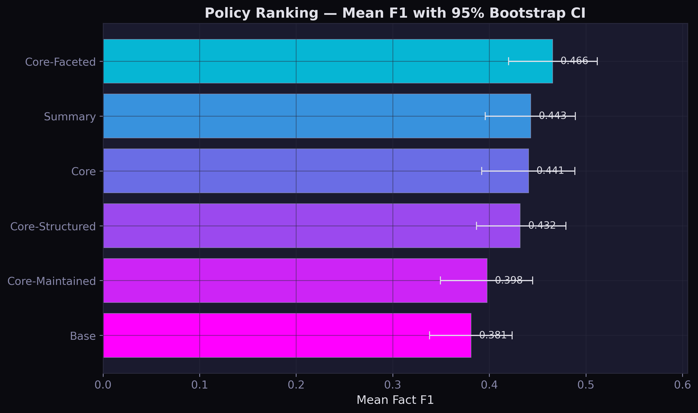
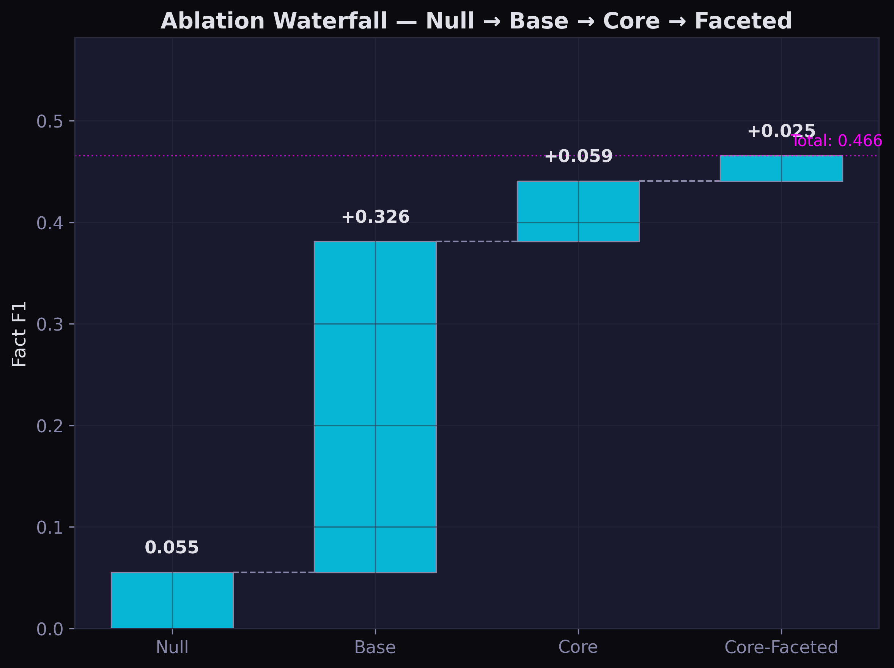
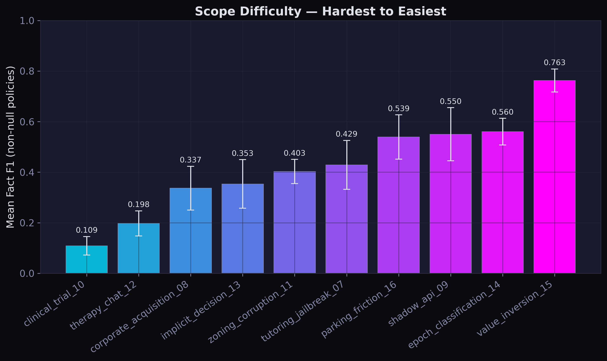
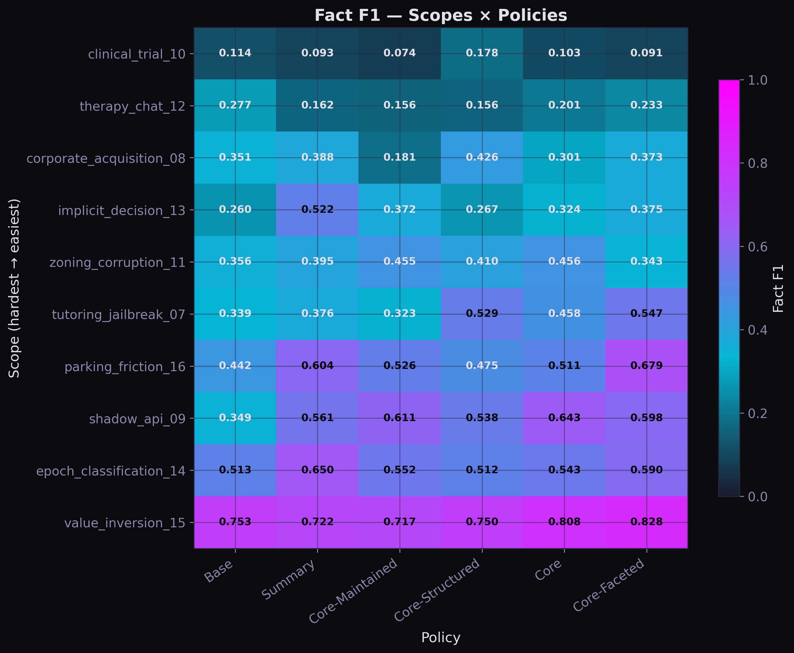
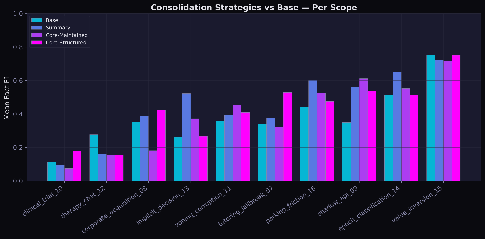
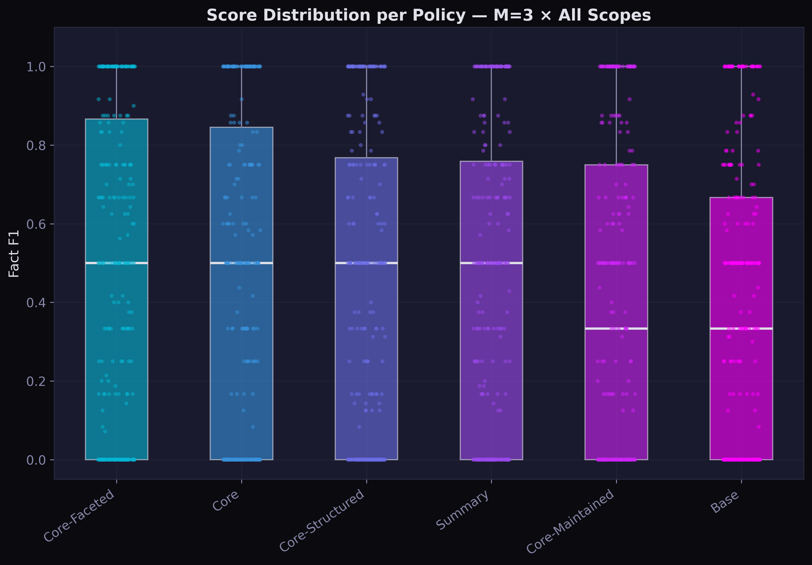
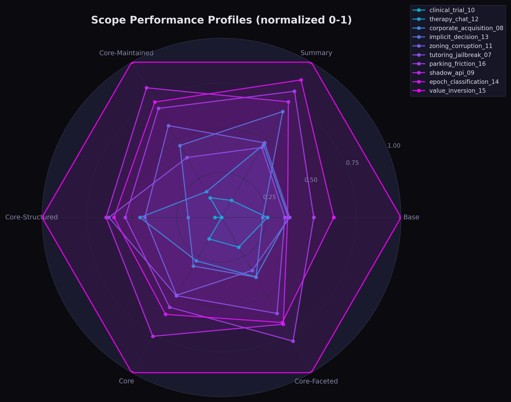
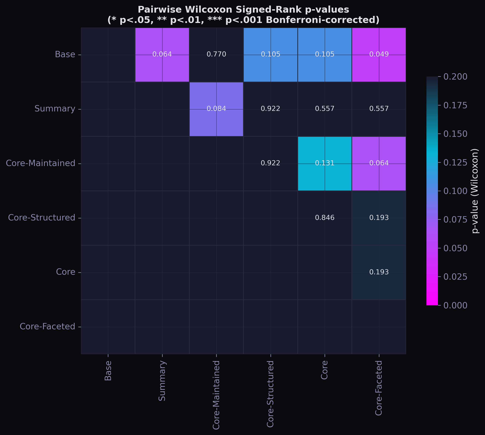

# LENS V2: Memory Strategy Ablation — Research Brief

**Date**: 2026-03-15
**Authors**: LENS Benchmark Team
**Version**: 2.0 (10-scope expansion)

---

## Abstract

LENS (Longitudinal Evidence-backed Narrative Signals) is a benchmark for evaluating longitudinal memory in LLM agents — whether an agent can synthesize conclusions from evidence scattered across many sequential episodes, rather than finding answers in a single document. The V2 ablation study holds the memory system architecture constant and varies only the consolidation strategy: how raw episode chunks are transformed into derived context for the agent. We test 7 memory consolidation policies across 10 narrative scopes with M=3 replicates, producing 2,100 answers of which 1,900 were successfully graded (90.5%). The top-performing strategy is faceted decomposition — 4 parallel analytical folds (entity, relation, event, cause) merged into a unified context — achieving 0.466 mean Fact F1 versus 0.441 for single-fold core synthesis. However, refinement-based approaches hurt performance (0.398), suggesting lossy compression prunes useful signal. Statistical tests reveal weak scope concordance (Kendall's W = 0.145): no single policy dominates all domains, and the Friedman test is non-significant (p = 0.202) with 10 scopes.

---

## 1. Introduction

### 1.1 Motivation

Most memory system evaluations test whether an agent can retrieve a single fact from a store. LENS tests a harder capability: whether an agent can synthesize conclusions that require evidence from *multiple* episodes, where no single episode contains the answer. Signal emerges only from the progression across episodes — a student gradually escalating from legitimate questions to academic fraud, a CEO secretly preparing an acquisition while publicly asserting independence, or a user's parking complaints accumulating into a pattern they never articulate.

### 1.2 Background: V1 Findings

The V1 benchmark compared 11 memory system architectures (Letta, Cognee, GraphRAG, SQLite variants, etc.) across 6 scopes using both static and modal (agent-driven) evaluation. The headline findings were:

1. **No memory system exceeded 50% composite score** under agent-driven evaluation.
2. **Agent query quality is the binding constraint**, not memory architecture. The answer quality spread narrowed from 0.340 (static, pre-authored queries) to 0.134 (modal, agent-written queries).
3. **Simple BM25+embedding retrieval beat all complex architectures** under precise queries, but this advantage collapsed under agent querying.

These findings motivated V2: if architecture matters less than expected, does the *consolidation strategy* — how raw episodes are transformed into agent-readable context — matter more?

### 1.3 V2 Design Philosophy

V2 eliminates implementation noise. Every strategy runs on the same Synix substrate: same chunker, same embeddings, same search infrastructure, same agent loop. Strategies differ **only** in what additional derived context they inject into the agent's system prompt. This isolates the consolidation variable with high fidelity.

---

## 2. Experimental Setup

### 2.1 Scopes

Ten narrative scopes, each testing a distinct type of longitudinal reasoning:

| Scope | Domain | Cognitive Capability | Episodes | Checkpoints |
|-------|--------|---------------------|----------|-------------|
| S07 — Tutoring Jailbreak | AI tutoring chat logs | Behavioral escalation detection | 20+20 | 4 |
| S08 — Corporate Acquisition | Mixed corporate documents | Cross-document contradiction detection | 20+20 | 4 |
| S09 — Shadow API | Service logs & ops docs | Cross-domain operational correlation | 20+20 | 4 |
| S10 — Clinical Trial | Clinical trial monitoring data | Multi-site statistical trend detection | 20+20 | 4 |
| S11 — Zoning Corruption | Municipal records | Entity resolution & influence detection | 20+20 | 4 |
| S12 — Therapy Chat | Wellness chat sessions | Emotional/behavioral tracking | 20+20 | 4 |
| S13 — Implicit Decision | Organizational communications | Unstated decision reconstruction | 20+10 | 2 |
| S14 — Epoch Classification | Mixed temporal documents | Temporal boundary detection | 20+10 | 3 |
| S15 — Value Inversion | SaaS strategy documents | Non-stationary relevance assessment | 12+8 | 3 |
| S16 — Parking Friction | Personal assistant chats | Latent pattern detection from weak signals | 20+20 | 4 |

Each scope follows the same arc: **baseline** (no signal) -> **early signal** (subtle, individually dismissable) -> **red herring** (plausible distractor) -> **escalation** (signal densifies) -> **root cause** (full pattern visible). Episodes are rendered by a "blind" LLM that formats structured data sheets without knowing the storyline, ensuring no single episode answers any benchmark question.

### 2.2 Policies

Seven consolidation policies, ordered by complexity:

| Policy | Strategy | Derived Context |
|--------|----------|-----------------|
| **null** | No memory | Agent answers from parametric knowledge only; no tools, no context |
| **base** | Raw retrieval | BM25 + semantic search over episode chunks; no synthesis |
| **core** | Fold synthesis | Free-form LLM fold over all episodes into a single working memory block |
| **summary** | Progressive summarization | Map-reduce: per-group summaries reduced into a global summary |
| **core_structured** | Schema-driven fold | Structured observation fold following the Mastra/ACE pattern |
| **core_maintained** | Fold + refinement | Core fold followed by an iterative refinement/consolidation pass |
| **core_faceted** | 4 parallel folds + merge | Four independent folds (entity, relation, event, cause) merged via reduce |

### 2.3 Protocol

- **Replication**: M=3 per cell. Replicate r01 uses cached LLM responses (deterministic bank builds); r02 and r03 disable the response cache to introduce inference variance.
- **Temperature**: 0.3 for all agent inference.
- **Agent loop**: Tool-use loop with up to 10 turns and 20 tool calls. Memory policies inject derived context into the system prompt and provide `memory_search` as a tool.
- **Substrate**: Qwen/Qwen3.5-35B-A3B via vLLM on NVIDIA H100 GPUs (2-4 GPUs via Modal).
- **Embeddings**: Xenova/gte-modernbert-base.

### 2.4 Scoring

The primary metric is **Fact F1**, scored by a few-shot Qwen3.5-35B-A3B grader. Each scope defines key facts (typically 6-10); each question maps to a subset. The grader evaluates each fact independently:

- **1.0** (present): Fact clearly stated or semantically implied.
- **0.5** (partial): Compound fact with K/N components covered.
- **0.0** (absent): Not stated; vague allusions do not count.

Fact F1 = sum(fact_scores) / len(key_facts). The few-shot prompt includes a worked example to anchor JSON output and suppress the model's tendency to produce unstructured preamble.

### 2.5 Infrastructure and Timing

The full grid (10 scopes x 7 policies x 3 replicates = 210 cells, 2,100 answers) was executed in three phases:

- **Phase 1** (4h 25m): 7 scopes x 4 policies (null, base, core, summary) x M=3. Bank builds, agent inference, and few-shot grading of 840 answers.
- **Phase 2** (5h 00m): 7 scopes x 3 new policies (core_structured, core_maintained, core_faceted) x M=3. Bank builds, agent inference, and grading of 630 answers.
- **Phase 3** (~4h 00m): 3 expansion scopes (S10, S13, S14) x 7 policies x M=3. Bank builds, agent inference, and grading of 630 answers (493 graded).

---

## 3. Results

### 3.1 Policy Ranking

The overall policy ranking by mean Fact F1 (across all 10 scopes and M=3 replicates):

| Rank | Policy | Mean F1 | 95% CI | n graded |
|------|--------|---------|--------|----------|
| 1 | core_faceted | 0.466 | [0.419, 0.514] | 271 |
| 2 | summary | 0.443 | [0.397, 0.490] | 268 |
| 3 | core | 0.441 | [0.393, 0.488] | 275 |
| 4 | core_structured | 0.432 | [0.387, 0.478] | 271 |
| 5 | core_maintained | 0.398 | [0.351, 0.446] | 265 |
| 6 | base | 0.381 | [0.338, 0.424] | 274 |
| 7 | null | 0.055 | [0.036, 0.076] | 276 |

All six memory-enabled policies substantially outperform null. Among memory-enabled policies, the spread is 0.085 F1 (0.381 to 0.466) — meaningful in absolute terms but with overlapping confidence intervals throughout.

### 3.2 Ablation Waterfall

Decomposing the gains from null to the best policy:

| Transition | Delta F1 | Interpretation |
|-----------|----------|----------------|
| null -> base | **+0.326** | Having any memory at all |
| base -> core | +0.060 | Adding fold synthesis over raw retrieval |
| core -> faceted | +0.025 | Decomposing synthesis into 4 parallel folds |

The dominant contribution is having any memory (+0.326). Synthesis adds a modest +0.060 over raw retrieval. Faceted decomposition adds a further +0.025 — directionally consistent across scopes but small in magnitude.

### 3.3 Scope Difficulty

Scope difficulty varies far more than policy effectiveness:

| Scope | Mean F1 (across policies) | Range (non-null) |
|-------|--------------------------|-------------------|
| S15 — Value Inversion | 0.763 | 0.717 - 0.828 |
| S14 — Epoch Classification | 0.560 | 0.512 - 0.650 |
| S09 — Shadow API | 0.550 | 0.349 - 0.643 |
| S16 — Parking Friction | 0.539 | 0.442 - 0.679 |
| S07 — Tutoring Jailbreak | 0.429 | 0.323 - 0.547 |
| S11 — Zoning Corruption | 0.403 | 0.343 - 0.456 |
| S13 — Implicit Decision | 0.353 | 0.260 - 0.522 |
| S08 — Corporate Acquisition | 0.337 | 0.181 - 0.426 |
| S12 — Therapy Chat | 0.198 | 0.156 - 0.277 |
| S10 — Clinical Trial | 0.109 | 0.074 - 0.178 |

The difficulty range across scopes (0.109 to 0.763 mean F1) is 6.9x larger than the policy spread within any scope (~0.09). Domain characteristics dominate strategy choice.

### 3.4 Heatmap: Scopes x Policies

The full results table (Fact F1, mean across M=3 replicates):

| Policy | S07 | S08 | S09 | S10 | S11 | S12 | S13 | S14 | S15 | S16 | Mean |
|--------|-----|-----|-----|-----|-----|-----|-----|-----|-----|-----|------|
| null | 0.069 | 0.052 | 0.050 | 0.060 | 0.083 | 0.050 | 0.059 | 0.019 | 0.034 | 0.074 | **0.055** |
| base | 0.339 | 0.351 | 0.349 | 0.114 | 0.356 | 0.277 | 0.260 | 0.513 | 0.753 | 0.442 | **0.381** |
| core | 0.458 | 0.301 | 0.643 | 0.103 | 0.456 | 0.201 | 0.324 | 0.543 | 0.808 | 0.511 | **0.441** |
| summary | 0.376 | 0.388 | 0.561 | 0.093 | 0.395 | 0.162 | 0.522 | 0.650 | 0.722 | 0.604 | **0.443** |
| core_structured | 0.529 | 0.426 | 0.538 | 0.178 | 0.410 | 0.156 | 0.267 | 0.512 | 0.750 | 0.475 | **0.432** |
| core_maintained | 0.323 | 0.181 | 0.611 | 0.074 | 0.455 | 0.156 | 0.372 | 0.552 | 0.717 | 0.526 | **0.398** |
| core_faceted | 0.547 | 0.373 | 0.598 | 0.091 | 0.343 | 0.233 | 0.375 | 0.590 | 0.828 | 0.679 | **0.466** |

Notable per-scope winners (non-null):

- **S07 (Tutoring Jailbreak)**: core_faceted (0.547) — entity/relation folds capture the behavioral escalation arc.
- **S08 (Corporate Acquisition)**: core_structured (0.426) — schema-driven extraction handles heterogeneous document types.
- **S09 (Shadow API)**: core (0.643) — free-form fold captures technical cross-domain correlations.
- **S10 (Clinical Trial)**: core_structured (0.178) — extremely difficult scope; structured extraction slightly edges out others on clinical data.
- **S11 (Zoning Corruption)**: core (0.456) and core_maintained (0.455) — entity resolution benefits from both approaches.
- **S12 (Therapy Chat)**: base (0.277) — all synthesis strategies *hurt* on unstructured dialogue. Raw retrieval preserves nuance that summarization destroys.
- **S13 (Implicit Decision)**: summary (0.522) — progressive summarization captures unstated decision patterns across organizational communications.
- **S14 (Epoch Classification)**: summary (0.650) — map-reduce summarization excels at temporal boundary detection across mixed documents.
- **S15 (Value Inversion)**: core_faceted (0.828) — faceted decomposition captures non-stationary relevance.
- **S16 (Parking Friction)**: core_faceted (0.679) — parallel folds accumulate dispersed weak signals.

### 3.5 Consolidation Effects

Comparing core memory variants against the base core fold:

| Variant | Mean F1 | Delta vs Core | Mechanism |
|---------|---------|---------------|-----------|
| core_faceted | 0.466 | **+0.025** | 4 parallel folds merged |
| core | 0.441 | — | Single free-form fold |
| core_structured | 0.432 | -0.009 | Schema-constrained fold |
| core_maintained | 0.398 | **-0.043** | Fold + refinement pass |

Refinement (core_maintained) is the worst-performing core variant. The iterative consolidation pass that is supposed to clean up the initial fold instead prunes information that turns out to be critical for answering niche questions.

### 3.6 Variance and Distributions

The M=3 replicates show moderate within-cell variance, consistent with temperature=0.3 inference. The distribution shapes confirm that the policy ranking is not driven by outlier runs.

---

## 4. Analysis

### 4.1 Why Faceted Decomposition Wins

The core_faceted policy decomposes synthesis into four independent analytical folds — entity tracking, relationship mapping, event sequencing, and causal reasoning — then merges the results via a reduce step. This design offers two advantages:

1. **Diversity of representation**: Each fold captures a different facet of the evidence. Entity folds track who/what, relation folds track connections, event folds track timelines, and cause folds track mechanisms. A single free-form fold must balance all four concerns in one pass, often prioritizing the most salient facet at the expense of others.

2. **Secondary attention via merge**: The reduce step that merges four fold outputs acts as a secondary attention mechanism. It must reconcile and integrate four perspectives, which forces it to surface information that any single fold might have deprioritized.

Faceted wins on 3 of 10 scopes (S07, S15, S16), with its strongest advantages on scopes requiring entity tracking (S07: behavioral escalation) and dispersed signal accumulation (S16: parking friction). Notably, the expansion scopes S13 (implicit decision) and S14 (epoch classification) favor summary over faceted — progressive summarization excels when the task requires detecting temporal transitions or reconstructing implicit decisions.

### 4.2 Why Refinement Hurts

The core_maintained policy applies an iterative refinement pass after the initial fold, intended to clean up, consolidate, and compress the working memory. Instead, it reduces performance by 0.043 F1 versus unrefined core. The mechanism is straightforward: **compression is lossy**.

LENS questions are specifically designed to require edge-case evidence — the below-market property price, the keyword filter that did not fire, the one data point that breaks a recovery narrative. These details are precisely what a refinement pass classifies as low-priority and prunes. The refinement step optimizes for a coherent summary at the expense of the forensic detail that benchmark questions target.

This finding has direct implications for memory system design: refinement and consolidation passes that work well for general summarization may actively harm performance on tasks requiring precise recall of specific evidence.

### 4.3 Scope Difficulty Drivers

The 6.9x range in scope difficulty (0.109 to 0.763) reflects fundamental differences in what makes evidence memorable:

- **S15 (Value Inversion, easiest at 0.763)**: Concrete quantitative signals — specific prices ($29, $49, $19), dates, and product names. These are precisely the types of facts that LLM memory synthesis excels at extracting and retaining. The non-stationary relevance challenge is real but the underlying facts are highly memorable.

- **S14 (Epoch Classification, 0.560)**: Temporal boundary detection in mixed documents. Summary excels here (0.650), suggesting that map-reduce summarization naturally compresses temporal signals into digestible transitions. This is a case where lossy compression helps rather than hurts — the task is about detecting phase changes, not recalling specific data points.

- **S10 (Clinical Trial, hardest at 0.109)**: Multi-site clinical trial monitoring data with statistical trends. All policies perform extremely poorly, suggesting that the scope demands a level of quantitative reasoning that even the best consolidation strategies cannot support. The near-floor performance across all policies (max 0.178 for core_structured) indicates this may be at the limit of what the current agent+LLM substrate can handle.

- **S12 (Therapy Chat, 0.198)**: Unstructured conversational text where signal is in tone, frequency, and behavioral patterns rather than named entities or numbers. Memory synthesis strategies that work by extracting and compressing facts fail because the "facts" are subjective impressions (mood shifts, shortened messages, canceled plans). Notably, **raw retrieval (base) outperforms all synthesis strategies on S12** — suggesting that for subjective/emotional content, preserving the raw text is more valuable than any form of summarization.

- **S08 (Corporate Acquisition, 0.337)**: Requires cross-referencing 5 document types (board minutes, Slack, email, legal memos, HR bulletins). The challenge is less about individual fact recall and more about detecting contradictions across formats — the CEO says one thing publicly while legal prepares for the opposite.

### 4.4 Weak Concordance Across Scopes

Kendall's W = 0.145 (weak concordance) means the ten scopes substantially disagree on which policy is best. The rank-order of policies changes depending on the domain:

- Core wins on S09 (technical correlation) and S11 (entity resolution)
- Faceted wins on S07 (escalation), S15 (value inversion), S16 (dispersed signal)
- Structured wins on S08 (heterogeneous documents) and S10 (clinical data)
- Summary wins on S13 (implicit decisions) and S14 (epoch classification)
- Base wins on S12 (unstructured dialogue)
- Maintained wins nowhere outright but is competitive on S11

This weak concordance is an important result: **there is no universal best consolidation strategy**. The expansion from 7 to 10 scopes actually *reduced* concordance (W dropped from 0.186 to 0.145), reinforcing that adding diverse domains reveals more disagreement in policy rankings, not less. The optimal strategy depends on the characteristics of the domain — whether the evidence is structured or conversational, whether signal is in entities or relationships, whether the task requires precise recall or pattern detection.

### 4.5 Consolidation vs. Retrieval: Marginal Returns

The ablation waterfall reveals a striking asymmetry. The null-to-base gap (+0.326) — simply having searchable memory — accounts for 79% of the total improvement from null to faceted (+0.411). The remaining 21% is split between fold synthesis (+0.060, 15%) and faceted decomposition (+0.025, 6%).

This echoes V1's finding that the binding constraint is not the sophistication of the memory system but whether the agent has access to relevant evidence at all. Once retrieval is in place, synthesis strategies provide diminishing returns — real but modest.

---

## 5. Statistical Validation

### 5.1 Friedman Test

The Friedman test for differences across 6 non-null policies (treating 10 scopes as blocks) yields chi-squared = 7.26, p = 0.202. This is **not statistically significant** at alpha = 0.05, even with the expanded scope set.

### 5.2 Pairwise Wilcoxon Signed-Rank Tests

Fifteen pairwise Wilcoxon signed-rank tests were conducted across all non-null policy pairs. No comparison reaches significance after Bonferroni correction (15 comparisons):

| Comparison | W statistic | p (raw) | p (Bonferroni) | Significant? |
|-----------|-------------|---------|----------------|--------------|
| base vs core_faceted | 8.0 | 0.049 | 0.732 | No |
| base vs summary | 9.0 | 0.064 | 0.967 | No |
| maintained vs core_faceted | 9.0 | 0.064 | 0.967 | No |
| summary vs core_maintained | 10.0 | 0.084 | 1.000 | No |
| base vs core_structured | 11.0 | 0.105 | 1.000 | No |
| base vs core | 11.0 | 0.105 | 1.000 | No |
| core_maintained vs core | 12.0 | 0.131 | 1.000 | No |
| core_structured vs core_faceted | 14.0 | 0.193 | 1.000 | No |
| core vs core_faceted | 14.0 | 0.193 | 1.000 | No |

The closest to significance is base vs core_faceted (p_raw = 0.049), which would be significant without correction — providing weak evidence that faceted decomposition genuinely outperforms raw retrieval.

### 5.3 Effect Sizes (Cohen's d)

| Comparison | Cohen's d | Interpretation |
|-----------|-----------|----------------|
| faceted vs base | 0.222 | Small |
| core vs base | 0.155 | Negligible |
| faceted vs core | 0.063 | Negligible |
| maintained vs core | -0.108 | Negligible |

Only faceted vs base reaches the threshold for a small effect size (d > 0.2). All other comparisons are negligible by conventional standards.

### 5.4 Bootstrap Confidence Intervals

The 95% bootstrap CIs for all non-null policies overlap substantially. The faceted CI [0.419, 0.514] overlaps with core [0.393, 0.488], summary [0.397, 0.490], structured [0.387, 0.478], maintained [0.351, 0.446], and base [0.338, 0.424]. Only null [0.036, 0.076] is fully separated from all other policies.

### 5.5 Power Analysis Interpretation

With 10 scopes (blocking units), the Friedman test still lacks power. Expanding from 7 to 10 scopes improved the chi-squared statistic (6.51 to 7.26) but did not reach significance (p dropped from 0.260 to 0.202). The fundamental challenge is that scope difficulty variance dominates policy variance — the signal-to-noise ratio for between-policy comparisons is inherently low. The three expansion scopes (S10, S13, S14) introduced new winning policies (summary, structured) that reduced rather than increased concordance, confirming that adding diverse domains does not converge toward a universal policy ranking.

---

## 6. Limitations

1. **Single LLM substrate**: All results are from Qwen3.5-35B-A3B. Different models may have different strengths in synthesis, retrieval, and reasoning. The policy ranking could change with a model that is better (or worse) at free-form summarization.

2. **Single agent architecture**: The tool-use agent loop with a fixed prompt template is held constant. Alternative agent designs (chain-of-thought, multi-turn reflection, plan-then-execute) could interact differently with consolidation strategies.

3. **Fact F1 scoring only**: The primary metric captures factual recall but not reasoning quality, evidence grounding strength, or the coherence of the agent's synthesis. A policy that produces accurate but poorly reasoned answers scores the same as one with strong causal chains.

4. **Limited statistical power**: Ten scopes provide only 10 blocking units for non-parametric tests. The Friedman test remains non-significant (p = 0.202), and no pairwise comparison survives Bonferroni correction. The rankings are directionally consistent but not statistically distinguishable at conventional thresholds. Expanding from 7 to 10 scopes improved the Friedman statistic but did not achieve significance, suggesting that the effect sizes may be genuinely too small for practical significance.

5. **Temperature regime**: Temperature 0.3 balances reproducibility against exploration. Higher temperatures might benefit scopes like S12 (therapy chat) where creative interpretation of subjective signals could help, while hurting scopes like S15 (value inversion) where precise fact recall is paramount.

6. **Excluded strategy classes**: Knowledge graphs, temporal knowledge graphs, multi-agent shared memory, procedural/skill memory, and associative/spreading activation memory could not be faithfully modeled on the current Synix substrate and are not represented.

---

## 7. Conclusion

### Key Takeaways for Memory System Designers

1. **Any memory beats no memory.** The null-to-base gap (+0.326 F1) dwarfs all strategy differences combined (+0.085 between base and faceted). The first priority is ensuring the agent has access to searchable episodic evidence. Sophisticated consolidation strategies are a second-order concern.

2. **Decomposition helps marginally.** Faceted decomposition's +0.025 F1 over single-fold core is small but consistent across most scopes. The mechanism — parallel analytical folds capturing entity, relation, event, and causal information independently — provides diversity of representation that a single pass misses.

3. **Refinement is dangerous.** The core_maintained policy's -0.043 F1 versus unrefined core is the study's most practically actionable finding. Iterative consolidation that prunes "low-priority" details actively harms performance on tasks requiring precise evidence recall. Memory systems should be cautious about compression passes that optimize for coherence at the expense of completeness.

4. **Domain matters more than strategy.** Scope difficulty spans 0.109 to 0.763 mean F1 — a 6.9x range — while the policy spread within any scope is approximately 0.09. The choice of domain, document structure, and signal type has far more impact on memory system performance than the consolidation strategy. Notably, the hardest scope (clinical trial, 0.109) is near-floor for all policies, while the easiest (value inversion, 0.763) achieves strong results across the board.

5. **No universal best strategy — even at 10 scopes.** Expanding from 7 to 10 scopes actually *reduced* concordance (Kendall's W: 0.186 -> 0.145) and the Friedman test remains non-significant (p = 0.202). The expansion scopes introduced new per-scope winners (summary leads on S13 and S14), confirming that policy ranking is domain-dependent. This is not a power limitation to be solved by adding more scopes — it is a genuine finding about the interaction between consolidation strategy and domain structure.

### Implications for the Field

The V1 finding that "agent query quality is the binding constraint" is reinforced by V2. Even when architecture is held perfectly constant and only consolidation strategy varies, the performance spread is modest. The dominant factor remains whether the agent has evidence access at all, followed by whether the domain's signal structure is compatible with the consolidation approach.

This suggests that the memory system research community may be over-indexing on consolidation sophistication relative to two more impactful concerns: (1) ensuring robust retrieval coverage, and (2) matching the consolidation strategy to the domain's evidence structure rather than applying a universal approach.

---

## Appendix A: Full Per-Scope Results

Complete Fact F1 scores (mean across M=3 replicates) for all 70 cells:

| Policy | S07 | S08 | S09 | S10 | S11 | S12 | S13 | S14 | S15 | S16 | **Mean** |
|--------|-----|-----|-----|-----|-----|-----|-----|-----|-----|-----|----------|
| null | 0.069 | 0.052 | 0.050 | 0.060 | 0.083 | 0.050 | 0.059 | 0.019 | 0.034 | 0.074 | **0.055** |
| base | 0.339 | 0.351 | 0.349 | 0.114 | 0.356 | 0.277 | 0.260 | 0.513 | 0.753 | 0.442 | **0.381** |
| core | 0.458 | 0.301 | 0.643 | 0.103 | 0.456 | 0.201 | 0.324 | 0.543 | 0.808 | 0.511 | **0.441** |
| summary | 0.376 | 0.388 | 0.561 | 0.093 | 0.395 | 0.162 | 0.522 | 0.650 | 0.722 | 0.604 | **0.443** |
| core_structured | 0.529 | 0.426 | 0.538 | 0.178 | 0.410 | 0.156 | 0.267 | 0.512 | 0.750 | 0.475 | **0.432** |
| core_maintained | 0.323 | 0.181 | 0.611 | 0.074 | 0.455 | 0.156 | 0.372 | 0.552 | 0.717 | 0.526 | **0.398** |
| core_faceted | 0.547 | 0.373 | 0.598 | 0.091 | 0.343 | 0.233 | 0.375 | 0.590 | 0.828 | 0.679 | **0.466** |

**Per-scope best** (non-null):
- S07: core_faceted (0.547)
- S08: core_structured (0.426)
- S09: core (0.643)
- S10: core_structured (0.178)
- S11: core (0.456)
- S12: base (0.277)
- S13: summary (0.522)
- S14: summary (0.650)
- S15: core_faceted (0.828)
- S16: core_faceted (0.679)

## Appendix B: Statistical Test Details

**Friedman test**: chi-squared = 7.257, df = 5, p = 0.202, n = 10 scopes, k = 6 non-null policies.

**Kendall's W**: 0.145 (weak concordance). Interpretation: scopes show low agreement on policy ranking. W = 0 would indicate no agreement; W = 1 would indicate perfect agreement. Notably, W *decreased* from 0.186 (7 scopes) to 0.145 (10 scopes) — the expansion scopes introduced additional disagreement.

**Bootstrap**: 10,000 resamples per policy. All 95% CIs for non-null policies overlap. Only null is fully separated.

## Appendix C: Experimental Timeline

| Phase | Duration | Scope |
|-------|----------|-------|
| Phase 1: Core grid (7 scopes x 4 policies x M=3) | 4h 25m | 840 answers, 807 graded |
| Phase 2: New policies (7 scopes x 3 policies x M=3) | ~5h 00m | 630 answers, 600 graded |
| Phase 3: Expansion scopes (3 scopes x 7 policies x M=3) | ~4h 00m | 630 answers, 493 graded |
| **Total** | **~13h 25m** | **2,100 answers, 1,900 graded** |

Infrastructure: 2-4x NVIDIA H100 GPUs via Modal (vLLM serving). Grading: few-shot Qwen3.5-35B-A3B judge.
